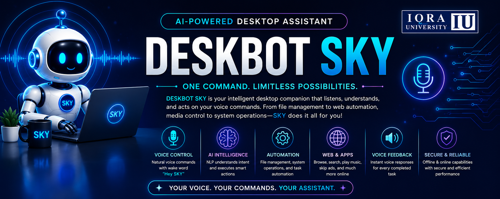

  

<h1 align="center">Hi 👋, I'm Sumaira Akbar</h1>

<h3 align="center">
🤖 AI Intern @ Pakistan Ordnance Factories (POF) | Computer Science Graduate | Former Full Stack Developer
</h3>

---

# 👩‍💻 About Me

I'm a **Computer Science Graduate** from **Iqra University** with hands-on experience in **Artificial Intelligence, Full Stack Web Development, Database Design, and Software Engineering**.

Currently, I'm working as an **AI Intern at Pakistan Ordnance Factories (POF), Wah Cantt**, where I'm gaining practical experience in AI technologies, intelligent automation, and enterprise software development.

Previously, I worked as a **Contract-Based Full Stack Developer**, where I migrated organizational data from **Google Sheets to MySQL**, designed the database architecture, and integrated the existing frontend with the backend while preserving the user interface.

I'm passionate about **Artificial Intelligence**, **Automation**, **Backend Development**, and building software that solves real-world problems.

---

# 💼 Experience

## 🤖 AI Intern
### Pakistan Ordnance Factories (POF), Wah Cantt

- Working on AI-powered applications and intelligent automation.
- Exploring Machine Learning and Natural Language Processing concepts.
- Developing AI-driven software solutions.
- Collaborating with engineers on enterprise-level projects.
- Applying software engineering best practices in real-world environments.

---

## 💻 Contract-Based Full Stack Developer

- Migrated company data from Google Sheets to MySQL.
- Designed and implemented the relational database schema.
- Connected the existing frontend with the MySQL backend without changing the UI.
- Developed backend functionality to store future records directly into MySQL.
- Improved data integrity, scalability, and application performance.

---

# 🚀 Featured Project

## 🤖 DESKBOT SKY — AI Powered Desktop Assistant

DESKBOT SKY is an intelligent voice-controlled desktop assistant developed as our Final Year Project.

It automates desktop operations using Artificial Intelligence, Speech Recognition, Natural Language Processing (NLP), and Desktop Automation.

### Key Features

- 🎙 Wake Word Detection ("Hey SKY")
- 🗣 Speech-to-Text
- 🔊 Text-to-Speech
- 🤖 AI Intent Recognition
- 📂 File & Folder Management
- 🖥 Desktop Automation
- 🌐 Web Automation
- 🎵 Spotify & YouTube Control
- 📸 Screenshot Capture
- 🌤 Weather Updates
- 🧮 Calculator
- 📧 Email Support
- 🔐 Google Authentication
- 💬 Voice Feedback after every completed task

---

# 🛠 Tech Stack

### Languages

### Frontend

### Backend

### Database

### AI & Automation

- Ollama
- Speech Recognition
- NLP
- PyAutoGUI
- PyAudio
- pyttsx3
- Tkinter

### Tools

---

# 📈 GitHub Statistics

---

# 🌱 Currently Learning

- Artificial Intelligence
- Machine Learning
- Large Language Models (LLMs)
- Backend Development
- System Design
- Enterprise AI Applications

---

# 🎯 Career Objective

To contribute to innovative AI and software engineering projects by developing scalable, intelligent, and impactful solutions while continuously expanding my technical expertise.

---

# 📫 Connect With Me

📧 **sumaira8366@gmail.com**

💼 **LinkedIn**

https://linkedin.com/in/sumaira-akbar

📍 **Pakistan**

---

---

<h3 align="center">

⭐ Thank you for visiting my profile!

"Turning ideas into intelligent software."

🚀 Let's build something amazing together.

</h3>
